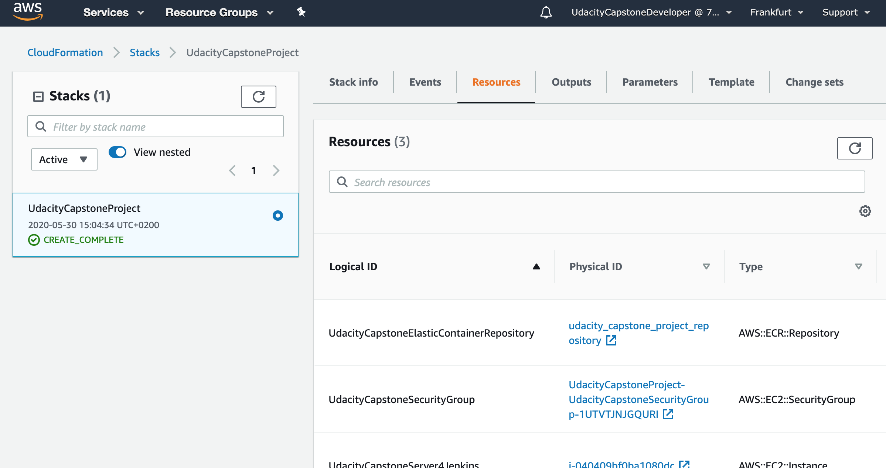
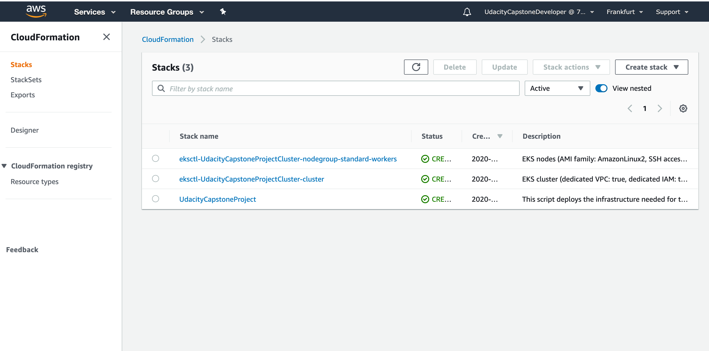
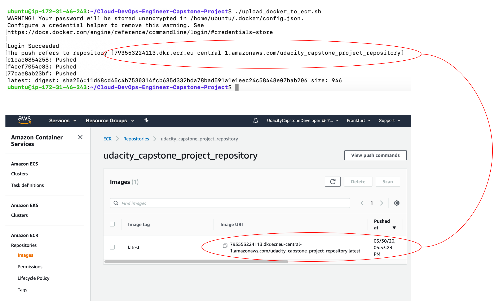

# Udacity's Cloud-DevOps-Engineer Nanodegree Program: The Capstone-Project
This repository contains my solution for the capstone-project of Udacity's Cloud DevOps Engineer Nanodegree Program.  For details of the program see [here](https://www.udacity.com/course/cloud-dev-ops-nanodegree--nd9991).
In this project the skills & knowledge which were developed throughout the Cloud DevOps Nanodegree program are applied in practice. These include:

* Working in AWS
* Using Jenkins to implement Continuous Integration and Continuous Deployment
* Building pipelines
* Working with Ansible and CloudFormation to deploy clusters
* Building Kubernetes clusters
* Building Docker containers in pipelines

## Project Overview

## Pipeline Setup
This section describes how to set up the continuous integration / continuous deployment pipeline that this repository contains.
### Spawn the Infrastructure using CloudFormation
The stack in Amazon Web Service is created by
`$ ./create.sh UdacityCapstoneProject infrastructure.yml parameters.json`.
After running the CloudFormation script with parameters, the stack appears with all resources and outputs as displayed in the figure below.

To create the Kubernetes Cluster in Amazon Web Service, an additional command line interface is used, the _eksctl_ API. The installation is outlined below. To spawn the Kubernetes Cluster, run `$ chmod u+x run_docker_image_on_local_host.sh` to grant permission to execute followed by

`$ create_eks_cluster.sh `

A successful creation of the cluster and the nodes will be visible in CloudFormation as displayed in the figure below.

**Note**: When the stack is deleted, all it's entities are removed as well. If the entities are created manually, one has to keep track of destruction of all entities after the infrastructure is not longer needed.

#### Spawn a Repository in Elastic Container Registry
As part of the stack, a repository is created in Amazon Web Service' Elastic Container Registry (ECR).
The repository name is defined in _parameters.json_, by the variable `RepositoryName`.
Note: Inside _infrastructure.yml_, a user has been hardcoded with rights to push and pull containers, see `- "arn:aws:iam::793553224113:user/UdacityCapstoneDeveloper"`. If you pull this GitHub-Repository and spawn the infrastructure, be sure to add and / or replace your users here.

#### Spawn a Security Group
A firewall solution that performs one primary function is needed: Filter incoming and outgoing traffic from an EC2 instance. In Amazon Web Service this solution is called a _Security Group_. It accomplishes this filtering function at the TCP and IP layers, via their respective ports, and source/destination IP addresses. The spawned filter allows

* outbound traffic to everyone.
* inboud traffic via SSH from one IP-Address - the IP-Address of the administrator / Cloud DevOps Engineer, who must ssh into the server (to be provided in _parameters.json_ as , `UdacityCapstoneDeveloperIP`)
* inbound traffic via TCP on port 80 from one IP-Address - the IP-Address of the administrator / Cloud DevOps Engineer, who must configure Jenkins (to be provided in _parameters.json_ as , `UdacityCapstoneDeveloperIP`)

#### Spawn a Web Server for Continuous Integration & Deployment
A web server is needed to host Jenkins and run tools that implement the continuous integration- & deployment-pipeline. The web server is an instance of Amazon Web Service's EC2-Solutions with

* machine image: Ubuntu Bionic-18.04-amd64 (ami-0e342d72b12109f91)
* type: t2.micro

#### Spawn a Kubernetes Cluster

#### Spawn a Kubernetes Nodegroup

### Setup the Web Server for Continuous Integration & Deployment
After the infrastructure has been spawned, the next step is to _ssh into_ the web server and install the tools that execute the continuous integration & deployment on the machine. First,

`$ sudo apt install make`

in order to install _make_. This allows to execute the _Makefile_.
The _Makefile_ can be found in the root of this repository; the repository must be checked out on the machine by

`$ git clone https://github.com/StephanStu/Cloud-DevOps-Engineer-Capstone-Project.git`

Then, cd into the created folder to and `$ ls` will display the _Makefile_.

#### Install Amazon Web Service's Command Line Interface & Kubernetes Cluster Control
Amazon Web Service's Command Line Interface is needed to access the infrastructure from the web server in an automatic fashion, e.g. to upload container images to the container repository provided by Amazon Web Service. To install Amazon Web Service's Command Line Interface,

`$ curl "https://awscli.amazonaws.com/awscli-exe-linux-x86_64.zip" -o "awscliv2.zip"``

Then, `$ unzip awscliv2.zip` and `$ sudo ./aws/install`. The installation can be tested with `$ aws --version`. Next, download and extract the latest release of _eksctl_, the command line tool that allows control of the Kubernetes cluster,  with the following command:

`$ curl --silent --location "https://github.com/weaveworks/eksctl/releases/latest/download/eksctl_$(uname -s)_amd64.tar.gz" | tar xz -C /tmp`

Move the extracted binary, `$ sudo mv /tmp/eksctl /usr/local/bin` and test that installation was successful by `$ eksctl version`. These guidelines have been taken from [this source](https://docs.aws.amazon.com/eks/latest/userguide/eksctl.html).
**Note**: The GitTag version should be at least 0.20.0.

#### Install Brew - A package management system
Brew is package management system that is needed to deploy necessary tools on the machine. To install brew, enable execution of _install_brew.sh_,

`$ chmod u+x install_brew.sh`

and

`$ make setup-brew`

After the installation is finished, configure Homebrew in your /home/ubuntu/.profile by running

`$ echo 'eval $(/home/linuxbrew/.linuxbrew/bin/brew shellenv)' >> /home/ubuntu/.profile`

and add Homebrew to your PATH,

`$ eval $(/home/linuxbrew/.linuxbrew/bin/brew shellenv)`

**Note:** This step requires the attention of the administrator, i.e. user input during execution is requested.

#### Install Docker
To install Docker, enable execution of _install_docker.sh_,

`$ chmod u+x install_docker.sh`

and

`$ make setup-docker`

**Note:** This step requires the attention of the administrator, i.e. user input during execution is requested.

#### Install GCC, hadolint & tidy
It is recommended by _Brew_, that GCC is installed on the server. Moreover, the pipleine requires to check Docker-Files and .html-files prior to their deyployment. Checking the files for semantic errors and non-functional requirements is also called _linting_. Consequently, _linters_ for Dockerfiles and .html-files must be installed on the web server. These tasks are wrapped up by

`$ make install`

Two linters are deployed on the machine: The linter for Docker-files is _hadolint_ & The linter for html-files is _tidy_.

**Note:** This step requires the attention of the administrator, i.e. user input during execution may be requested because packages might be out-of-date. Successfull execution of this procedure exits with `Toolchain is installed.`.

**Note:** It is recommended to run `make test` to check if installation has been successfull. If this command does not exit with `Toolchain is ready.`, errors must be fixed before the next step.

#### Run the Docker-Image
This file must be given permission to run (run `$ chmod u+x run_docker_image_on_local_host.sh` first). The docker image is build by

`$ chmod u+x build_docker_image.sh` (to allow execution) followed by `$ ./build_docker_image.sh`

After the image has been build, all images available on the host are listed.
Note, that the recently created image appears in the list.
The image can be run by

`$ ./run_docker_image_on_local_host.sh`

Then, the web server is running as a containerized application and publishes the static website on port 8000 of the host as displayed in the merged screenshots below.

**Note:** If you see `Got permission denied while trying to connect to the Docker daemon socket at unix:///...`, search for help [here](https://www.digitalocean.com/community/questions/how-to-fix-docker-got-permission-denied-while-trying-to-connect-to-the-docker-daemon-socket).

#### Configure Credentials of Amazon Web Service's Command Line Interface & Upload the Image to the Container Repository
One goal of the pipeline is to keep track of healthy container images. Therefor, linted & tested images are kept in a container repository provided by Amazon Web Services, the Elastic Container Registry, that has been spawned as part of the infrastructure.
To enable this, configure the credentials of the command line interface on the server locally with approproiate user credentials (access to ECR is needed) by,

`$ aws configure`

Enter access key and secret access key of a user with appropriate credentials (administrator rights always work, but this is in conflict with the _least privilege policy_ taught in the class).
To upload container images to the container repository created as part of the stack in _infrastructure.yml_, run `$ chmod u+x upload_docker_to_ecr.sh` followd by

`$ ./upload_docker_to_ecr.sh`

The previously created docker image is now pushed into the container repository provided by Amazon Web Service (an alternative container repository is DockerHub, see the Knowledge section).

#### Install & Configure Jenkins - The Continuous Integration / Continuous Deployment Tool
To install Jenkins, the Docker-Image must be stopped first, such that the port 8000 is vacant.

## Pipeline Components
This section describes the individual components of the continuous integration / continuous deployment pipeline that this repository contains.
### Lint the Dockerfile
The Dockerfile gives docker instructions how to build the image and what to do with it, e.g. run the image with port-forwarding. The Dockerfile is checked both syntactically and with respect to non-functional guidelines (e.g. _Dockerfile:2 DL3006 Always tag the version of an image explicitly_), such that one can be sure, the image builds correctly before kicking off the build. The tool used to perform these checks is hadolint, to run the checks

`$ hadolint Dockerfile`

## Knowledge
This section wraps up useful knowledge that is needed in the context of cloud-native development operations.

### Docker-Commands
Docker-Containers can be considered as single-purpose virtual machines that can be deployed on a host to provide a single service; many base-images can be found on the DockerHub that can be re-used to produce high-quality of service products. This sub-section wraps up some Docker-Commands that are frequently needed:

* To build a container from Dockerfile: `$ docker build --tag=[name-of-image] .`
* To list all images on the host: `$ docker image ls`
* To remove an image from the host: `$ docker rmi [name-of-image]`
* To list running containers: `$ docker container ls`
* To stop a container running: `$ docker container stop [ID-of-container]`

### Python-Commands for Virtual Environments
Creating a virtual environment makes it easier to provide necessary packages for an application in a location on the host that is _under full management of the user_.

* To create a virtual environment: `$ python3 -m venv [name-of-environment]`

### DockerHub: An Alternative Container Repository: _upload docker to dockerhub.sh_
This file must be given permission to run (run `$ chmod u+x upload_docker_to_dockerhub.sh` first). The docker image is uploaded to DockerHub by

`$ ./upload_docker_to_dockerhub.sh`

After the image has been uploaded, it is visible in the DockerHub-Account as a new (or refreshed) repository.

