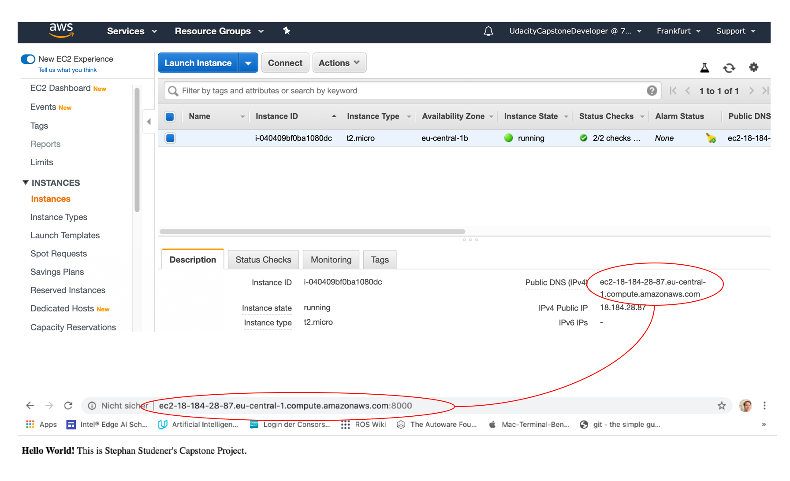
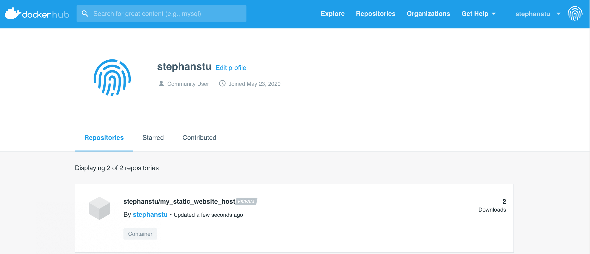

# Udacity's Cloud-DevOps-Engineer Nanodegree Program: The Capstone-Project
This repository contains my solution for the capstone-project of Udacity's Cloud DevOps Engineer Nanodegree Program.  For details of the program see [here](https://www.udacity.com/course/cloud-dev-ops-nanodegree--nd9991).
In this project the skills & knowledge which were developed throughout the Cloud DevOps Nanodegree program are applied in practice. These include:

* Working in AWS
* Using Jenkins to implement Continuous Integration and Continuous Deployment
* Building pipelines
* Working with Ansible and CloudFormation to deploy clusters
* Building Kubernetes clusters
* Building Docker containers in pipelines

## Project Overview

## Pipeline Setup
This section describes how to set up the continuous integration / continuous deployment pipeline that this repository contains.
### Spawn the Infrastructure using CloudFormation
The stack in Amazon Web Service is created by
`$ ./create.sh UdacityCapstoneProject infrastructure.yml parameters.json`.
Note: When the stack is deleted, all it's entities are removed as well.
#### Spawn a Repository in ECR
As part of the stack, a repository is created in Amazon Web Service' Elastic Container Registry (ECR).
The repository name is defined in _parameters.json_, by the variable `RepositoryName`.
Note: Inside _infrastructure.yml_, a user has been hardcoded with rights to push and pull containers, see `- "arn:aws:iam::793553224113:user/UdacityCapstoneDeveloper"`. If you pull this GitHub-Repository and spawn the infrastructure, be sure to add and / or replace your users here.
#### Spawn a Security Group
A firewall solution that performs one primary function is needed: Filter incoming and outgoing traffic from an EC2 instance. In Amazon Web Service this solution is called a _Security Group_. It accomplishes this filtering function at the TCP and IP layers, via their respective ports, and source/destination IP addresses. The spawned filter allows

* outbound traffic to everyone.
* inboud traffic via SSH from one IP-Address - the IP-Address of the administrator / Cloud DevOps Engineer, who must ssh into the server (to be provided in _parameters.json_ as , `UdacityCapstoneDeveloperIP`)
* inbound traffic via TCP on port 80 from one IP-Address - the IP-Address of the administrator / Cloud DevOps Engineer, who must configure Jenkins (to be provided in _parameters.json_ as , `UdacityCapstoneDeveloperIP`)

#### Spawn a Web Server for Continuous Integration & Deployment

### Install Jenkins - The Continuous Integration / Continuous Deployment Tool
### Install Brew - A package management system
### Install hadolint - A linter for Docker-files
### Install tidy - A linter for html-Files

## Pipeline Components
This section describes the individual components of the continuous integration / continuous deployment pipeline that this repository contains.
### Lint the Dockerfile
The Dockerfile gives docker instructions how to build the image and what to do with it, e.g. run the image with port-forwarding. The Dockerfile is checked both syntactically and with respect to non-functional guidelines (e.g. _Dockerfile:2 DL3006 Always tag the version of an image explicitly_), such that one can be sure, the image builds correctly before kicking off the build. The tool used to perform these checks is hadolint, to run the checks

`$ hadolint Dockerfile`

### Build the Docker-Image: _run docker.sh_
This file must be given permission to run (run `$ chmod u+x run_docker.sh` first). The docker image is build by

`$ ./run_docker.sh`

After the image has been build, all images available on the host are listed.
Note, that the image `my_static_website_host` appears in the list.
The image can be run by

`$ docker run -p 8000:80 my_static_website_host`

Then, the web server is running as a containerized application and publishes the static website on port 8000 of the host.

### Upload the Docker-Image to DockerHub: _upload docker.sh_
This file must be given permission to run (run `$ chmod u+x upload_docker.sh` first). The docker image is uploaded to DockerHub by

`$ ./run_docker.sh`

After the image has been uploaded, it is visible in my DockerHub-Account as a new (or refreshed) repository.

## Knowledge
This section wraps up useful knowledge that is needed in the context of cloud-native development operations.
### Docker-Commands
Docker-Containers can be considered as single-purpose virtual machines that can be deployed on a host to provide a single service; many base-images can be found on the DockerHub that can be re-used to produce high-quality of service products. This sub-section wraps up some Docker-Commands that are frequently needed:

* To build a container from Dockerfile: `$ docker build --tag=[name-of-image] .`
* To list all images on the host: `$ docker image ls`
* To remove an image from the host: `$ docker rmi [name-of-image]`
* To list running containers: `$ docker container ls`
* To stop a container running: `$ docker container stop [ID-of-container]`

### Python-Commands for Virtual Environments
Creating a virtual environment makes it easier to provide necessary packages for an application in a location on the host that is _under full management of the user_.

* To create a virtual environment: `$ python3 -m venv [name-of-environment]`
