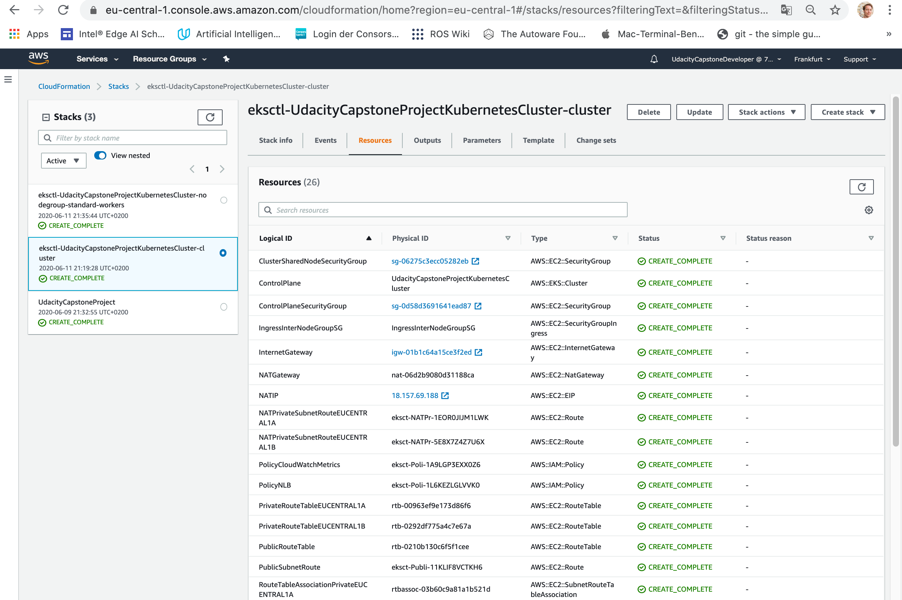
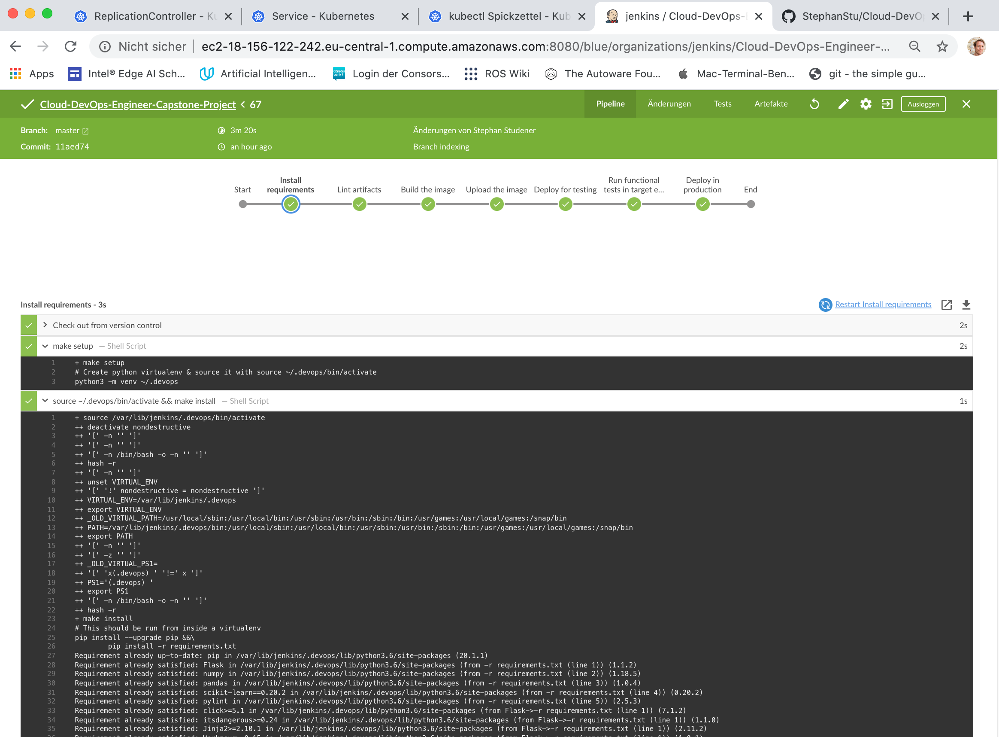

# Udacity's Cloud-DevOps-Engineer Nanodegree Program: The Capstone-Project
This repository contains my solution for the capstone-project of Udacity's Cloud DevOps Engineer Nanodegree Program. For details of the program see [here](https://www.udacity.com/course/cloud-dev-ops-nanodegree--nd9991).
In this project the skills & knowledge which were developed throughout the Cloud DevOps Nanodegree program are applied in practice. These include:

* Working in AWS
* Using Jenkins to implement Continuous Integration and Continuous Deployment
* Building pipelines
* Working with CloudFormation (Infrastructure-as-code) to spawn infrastructure & a Kubernetes cluster
* Building Kubernetes nodes, pods and services in the cluster
* Building Docker containers in pipelines

As an application, a machine learning microservice has been chosen, that predicts house prices in the Boston-area. The microservice can be reached via a json-formatted call, an example is given in `test_prediction.sh`.

## Section I: Project Overview
In this project the rolling-deployment pattern is implemented in a cloud-native fashion with Jenkins and a set of services of Amazon Web Services. A machine learning microservice is containerized inside a continuous integration & deployment pipeline.
After running static code analysis (_linting_ of the python- and docker-artifacts), the docker-image must be build and pushed to the docker-hub.

Two environments must be created, which must be equal: One environment serves for testing of the deployed application and the other one serves as a production environment which must be accessible all day and night by customers. In order to make sure, development errors do not sneak into production, any change to the application must be deployed & tested in the test-environment before being deployed in the production environment. Since the test- and the production-environment are equal, a validation in the test-environment gives the organization the necessary confidence to deploy in the production environment just after testing has finished with _OK-results_.  

## Section II: Results & Guideline to Build this Project
This section wraps up the achievements of this project.
### Setup of a Jenkins Server and Integration of Jenkins with DockerHub and Amazon Web Service's Kubernetes Solution
A server has been setup in Amazon Web Service, which operates the continuous integration & deployment pipeline. The server can be initialized quickly again, because every part of the infrastructure is defined in code in the folder `/infrastructure` , e.g. the CloudFormation files (`/infrastructure/infrastructure.yml`, `/infrastructure/parameters.json`) and the `/infrastructure/Makefile`, that creates the Kubernetes Cluser and installs necessary tools to lint the artifacts of the microservice. In the figure below, the Jenkins-Screen-Homescreen is displayed together with AWS::EC2-Management console displaying the URL of the Jenkins-Server.  

  

Jenkins has been configured with necessary credentials to

* push docker images to DockerHub.
* update the Kubernetes Cluster in AWS::EKS.

**Note**: Jenkins is reached a port 8080 of the AWS::EC2-Instance.

### Setup of a Continuous Integration / Continuous Deployment Pipeline
A continuous integration & deployment pipeline has been defined by the `Jenkinsfile` in the root of this repository. It implements the necessary requirements of this project.

The steps of the continuous integration & deployment pipeline are:

* Installing requirements of the microservice `app.py`.
* Linting of the artifacts of the microservice `app.py`.
* Building of a docker container image.
* Pushing the image to DockerHub.
* Deployment of the application in a test environment.
* Functional testing of the application in the test environment (this could be automated further and enhanced with load-tests).
* Deployment of the application in the production environment after successful outcome of the test run has been confirmed.

### Functional Testing of a Machine Learning Microservice inside the Continuous Integration / Continuous Deployment Pipeline
Any change to the application must be deployed & tested in the test-environment before being deployed in the production environment.
This gives the organization the confidence, that the service can be provided to it's customers. In this project this is implemented by making a reference call to the machine learning microservice and comparing the outcome with an expected outcome.

This could be subject to further automation and enhancement, e.g. followed by load-testing.

### Further Details of the Continuous Integration / Continuous Deployment Pipeline
The following sections describe the details of the implementation of the deployment pattern,

* Section III describes in detail how to spawn the infrastructure in Amazon Web Services using CloudFormation.
* Section IV describes in detail how to setup the web server, that operates the pipeline.
* Section V describes the pipeline in detail.
* Section VI wraps up knowledge on Kubernetes, Docker and useful ways-of-working with Kubernetes.

## Section III: Spawn the Infrastructure using CloudFormation
This section describes how to set up the infrastructure for the continuous integration / continuous deployment pipeline that this repository contains. The infrastructure is spawned using Amazon Web Service's CloudFormation, a language for deploying _infrastructure-as-code_. One of the many advantages of CloudFormation is, that the infrastructure can be deleted and updated from command line, so it is easy to keep track of a large number of entities in an account. All files needed to setup the infrastructure are kept in `/infrastructure`, e.g. the `Makefile` that installs all necessary tools.
The _stack_ in Amazon Web Service is created by `$ cd infrastructure` on your own machine and running

`$ ./create.sh UdacityCapstoneProject infrastructure.yml parameters.json`.

After running the CloudFormation script with parameters, the stack appears with all resources and outputs as displayed in the figure below.

**Note**: When the stack is deleted, all it's entities are removed as well. If the entities are created manually, one has to keep track of destruction of all entities after the infrastructure is not longer needed.

### Spawn a Security Group
This is done as part of running `$ ./create.sh UdacityCapstoneProject infrastructure.yml parameters.json`.
A firewall solution that performs one primary function is needed: Filter incoming and outgoing traffic from an EC2 instance. In Amazon Web Service this solution is called a _Security Group_. It accomplishes this filtering function at the TCP and IP layers, via their respective ports, and source/destination IP addresses. The spawned filter allows

* outbound traffic to everyone.
* inboud traffic via SSH from one IP-Address - the IP-Address of the administrator / Cloud DevOps Engineer, who must ssh into the server (to be provided in _parameters.json_ as , `UdacityCapstoneDeveloperIP`)
* inbound traffic via TCP on port 80 from one IP-Address - the IP-Address of the administrator / Cloud DevOps Engineer, who must configure Jenkins (to be provided in _parameters.json_ as , `UdacityCapstoneDeveloperIP`)

### Spawn a Web Server for Continuous Integration & Deployment
This is done as part of runnig `$ ./create.sh UdacityCapstoneProject infrastructure.yml parameters.json`.
A web server is needed to host Jenkins and run tools that implement the continuous integration- & deployment-pipeline. The web server is an instance of Amazon Web Service's EC2-Solutions with

* machine image: Ubuntu Bionic-18.04-amd64 (ami-0e342d72b12109f91, all tools work with Ubuntu Linux)
* type: c3.large (additional memory compared to t2.micro is needed in order to build & keep docker images on the host)

After spawning the server and the worker-nodes of the Kubernetes Cluster, in the AWS::EC2-Management Console, machines can be observed as displayed in the figure below.

### Spawn a Kubernetes Cluster
A Kubernetes Cluster is a set of nodes, that may be deployed on a number of Amazon EC2 instances. It is created prior to creation of _worker-nodes_. After the initial infrastructure (Web Server, Security Group) has been spawned, the next step is to spawn the cluster. To do so, _ssh into_ the web server, `$ git clone https://github.com/StephanStu/Cloud-DevOps-Engineer-Capstone-Project.git` to clone this repository locally and install the tool that sets up the continuous integration & deployment pipeline on the machine. To do this, `$ cd infrastructure` and run

`$ sudo apt install make`

in order to install _make_. This allows to execute the _Makefile_, `/infrastructure/Makefile`. To create the Kubernetes Cluster in Amazon Web Service, an additional command line interface is used, the _eksctl_ API. To do this, `$ cd infrastructure` and execute

`$ make aws-command-line-tools`

You are asked to configure credentials of the Amazon Web Service Command Line Interface. Use a user, that has sufficient permissions to access AWS::EC2 and AWS::EKS. To spawn the Kubernetes Cluster, change directory to `infrastructure` and execute

`$ make kubernetes-cluster`

A successful creation of the cluster and the nodes will be visible in CloudFormation as displayed in the figure below.

**Note**: When the stack is deleted, all it's entities are removed as well. If the entities are created manually, one has to keep track of destruction of all entities after the infrastructure is not longer needed.

### Spawn a Kubernetes Nodegroup
This is done as part of runnig `$ make kubernetes-cluster`.
Worker machines in Kubernetes are called nodes. Nodes contain pods and pods contain the containerized applications - docker images. Amazon's implementation of Kubernetes lets worker nodes run in an account and connect to a cluster's control plane via the cluster API server endpoint. One or more worker nodes are deployed into a node group. A node group is one or more Amazon EC2 instances that are deployed in an Amazon EC2 Auto Scaling group. A successful creation of the worker-nodes and the nodes will be visible in CloudFormation as displayed in the figure below.

## Section IV: Setup the Web Server for Continuous Integration & Deployment
After the infrastructure has been spawned, the next step is to _ssh into_ the web server and install the tools that execute continuous integration & deployment on the machine. First,

`$ sudo apt install make`

in order to install _make_. This allows to execute the _Makefile_.
The _Makefile_ can be found in the root of this repository; the repository must be checked out on the machine by

`$ git clone https://github.com/StephanStu/Cloud-DevOps-Engineer-Capstone-Project.git`

Then, cd into the created folder to and `$ ls` will display the _Makefile_.

### Install Amazon Web Service's Command Line Interface & Kubernetes Cluster Control
Amazon Web Service's Command Line Interface is needed to access the infrastructure from the web server in an automatic fashion, e.g. to upload container images to the container repository provided by Amazon Web Service. To install Amazon Web Service's Command Line Interface,

`$ curl "https://awscli.amazonaws.com/awscli-exe-linux-x86_64.zip" -o "awscliv2.zip"``

### Install Brew - A package management system
Brew is package management system that is needed to deploy necessary tools on the machine. To install brew, enable execution of _install_brew.sh_,

### Install Docker
To install Docker, enable

**Note:** If you see `Got permission denied while trying to connect to the Docker daemon socket at unix:///...`, search for help [here](https://www.digitalocean.com/community/questions/how-to-fix-docker-got-permission-denied-while-trying-to-connect-to-the-docker-daemon-socket).

### Install GCC, hadolint & pylint
It is recommended by _Brew_, that GCC is installed on the server. Moreover, the pipeline requires to check Docker-Files and .html-files prior to their deployment. Checking the files for semantic errors and non-functional requirements is also called _linting_. Consequently, _linters_ for Dockerfiles and .html-files must be installed on the web server. These tasks are wrapped up by

### Configure Credentials of Amazon Web Service's Command Line Interface & Upload the Image to the Container Repository
One goal of the pipeline is to keep track of healthy container images. Therefor, linted & tested images are kept in a container repository provided by Amazon Web Services, the Elastic Container Registry, that has been spawned as part of the infrastructure.
To enable this, configure the credentials of the command line interface on the server locally with appropriate user credentials (access to ECR is needed) by,

`$ aws configure`

Enter access key and secret access key of a user with appropriate credentials (administrator rights always work, but this is in conflict with the _least privilege policy_ taught in the class).
To upload container images to the container repository created as part of the stack in _infrastructure.yml_, run `$ chmod u+x upload_docker_to_ecr.sh` followd by

`$ ./upload_docker_to_ecr.sh`

The previously created docker image is now pushed into the container repository provided by Amazon Web Service (an alternative container repository is DockerHub, see the Knowledge section).

### Install & Configure Jenkins - The Continuous Integration / Continuous Deployment Tool
Jenkins will be available on port 8080 of the web server. The URL can be found in the EC2-Management Console as shown in the figure below.

#### Step 5b): _Sometimes_ packages are not (yet) valid and keys must be added manually
This can be resolved shown in the figure below

Run this command and replace the missing keys:

`$ sudo apt-key adv --keyserver keyserver.ubuntu.com --recv-keys <ENTER MISSING KEY HERE>`

Make sure, that Jenkins is able to access docker by

`$ sudo usermod -a -G docker jenkins`

#### Step 9: Get initial password and unlock Jenkins
Catch the initial password on the host and go to port 8080 of the server. Here, Jenkins waits to be unlocked. Use the password obtained at the host above and arrive at what is displayed in the figure below.

#### Step 10: Install PlugIns
"Blue Ocean" and other required plugins need to be installed. Logged in as an admin, go to the top left, click 'Jenkins', then 'manage Jenkins', and select 'Manage Plugins'.
Use the "Available" tab, filter by "Blue Ocean," select the first option ("BlueOcean aggregator") and install without a restart. Filter once again for "pipeline-aws" and install, this time selecting "Download now and install after restart."
One the host, run

`$ sudo systemctl restart jenkins`

 An "Open Blue Ocean" link should show up in the sidebar. Click it, and it will take you to the "Blue Ocean" screen, where projects will be managed.

## Section V: The Continuous Integration / Continuous Deployment Pipeline
This section describes the individual steps of the continuous integration / continuous deployment pipeline for machine learning microservice. Jenkins operates from the root directory of this repository and is controlled by the `Jenkinsfile`. A large part of the commands of the `Jenkinsfile` are swapped out to the `Makefile` because it might be necessary to run these manually from the server during maintenance of the pipeline.

### Step 1: _Install requirements_
Jenkins installs requirements defined in `requirements.txt`. They are given by developers of the microservice. When these requirements change, Jenkins installs the new dependencies on it's host. A successful completion of this stage looks like displayed in the figure below.

### Step 2: _Lint artifacts_

A successful completion of this stage looks like displayed in the figure below.

### Step 3: _Build the image_
Jenkins builds the docker image locally. In the command line, this can be observed as shown in the figure below.

**Note:** The image is stored on the host. Now and then the host must be cleaned in order to make sure there is enough free disc space for images. This can be done by running `$ docker rmi $(docker images -a -q) --force` on the host of Jenkins.

A successful completion of this stage looks like displayed in the figure below.

### Step 4: _Upload the image_
Jenkins uploads the image to the DockerHub using my credentials. In DockerHub, a push can be noticed as displayed in the figure below

A successful completion of this stage looks like displayed in the figure below.

### Step 5: _Deploy for testing_
Jenkins deploys the microservice in it's target environment. Here it is supposed to be tested. The microservice is run by a [ReplicationController](https://kubernetes.io/docs/concepts/workloads/controllers/replicationcontroller/). This kind of controller ensures that a specified number of pod replicas are running at any one time. In other words, a ReplicationController makes sure that a pod or a homogeneous set of pods is always up and available. A successful completion of this stage looks like displayed in the figure below.

The ReplicationController is connected to the outside world by a [LoadBalancer](https://kubernetes.io/docs/concepts/services-networking/service/). On cloud providers which support external load balancers, such as Amazon Web Services, this Kubernetes Service makes sure, the application can be catched at the URL of the LoadBalancer. The URL can be seen in the figure below, which is a command line output of step five of the pipline.

### Step 6: _Run functional tests in target environment_
Jenknis runs a test script in this section, `test_prediction.sh`. This script makes a reference call to the deployed microservice and hence

* verifies, that the microservice is deployed correctly and can be accessed over the internet (proof, that "we are doing things right")
* validates, that the microservice is producing the expected result (proof, thet "we are doing the right things"). This can be regarded as a regression test.

A successful completion of this stage looks like displayed in the figure below.

### Step 7: _Deploy in production_
Once verification & validation in the test environment is complete (approved by a user input), it is time to deploy the microservice in it's production environment. This step is the same as step five, but yields the URL of the LoadBalancer of the production environment, which must be communicated to the customers of the microservice.
A successful completion of this stage looks like displayed in the figure below.

Since the test environment and the production environment are equal, there is no configuration drift and the organization can deploy to production immediatley after successful testing in the test environment.

## Section VII: Knowledge
This section wraps up useful knowledge that is needed in the context of cloud-native development operations.

### Docker-Commands
Docker-Containers can be considered as single-purpose virtual machines that can be deployed on a host to provide a single service; many base-images can be found on the DockerHub that can be re-used to produce high-quality of service products. This sub-section wraps up some Docker-Commands that are frequently needed:

* To build a container from Dockerfile: `$ docker build --tag=[name-of-image] .`
* To list all images on the host: `$ docker image ls`
* To remove an image from the host: `$ docker rmi [name-of-image]`
* To list running containers: `$ docker container ls`
* To stop a container running: `$ docker container stop [ID-of-container]`

### DockerHub: An Alternative Container Repository: _upload docker to dockerhub.sh_
For those, who do not work inside Amazon Webs Service and use their local, native distribution of Kubernetes, there is an alternative to managing Docker-Images - the [DockerHub](https://hub.docker.com/). To upload an image, you have to register in DockerHub. Then,
this file must be given permission to run (run `$ chmod u+x upload_docker_to_dockerhub.sh` first). The docker image is uploaded to DockerHub by

`$ ./upload_docker_to_dockerhub.sh`

After the image has been uploaded, it is visible in the DockerHub-Account as a new (or refreshed) repository.

### GitHub
When working with continuous integration & deployment Pipelines and GitHub as configuration management tool, one must be able to create access tokens for tools to operate on the repositorys. To generate these, visit
https://github.com/settings/tokens/new?scopes=repo,read:user,user:email,write:repo_hook
and create a token with your credentials.

### Jenkins
After installation of Jenkins a few more commands are needed to manage the pipelines:

* Get the initial password of Jenkins: `$ sudo cat /var/lib/jenkins/secrets/initialAdminPassword`
* Restart Jenkins on the host: `$ sudo systemctl restart jenkins`
* Add Jenkins to docker users: `$ sudo usermod -a -G docker jenkins`

### Kubernetes
Kubernetes is a free & open-source container-orchestration system for automating application deployment, scaling, and management initially designed by Google (see [here](https://en.wikipedia.org/wiki/Kubernetes)). It aims to provide a platform for automating deployment, scaling, and operations of application containers across clusters of hosts, as illustrated by the following image (taken from [here](https://kubernetes.io/de/docs/tutorials/kubernetes-basics/explore/explore-intro/)),

Containers usually means Docker-Images but a range of container tools is supported. Many cloud services offer a Kubernetes-based platform or infrastructure as a service (PaaS or IaaS) on which Kubernetes can be deployed as a platform-providing service. Many vendors also provide their own branded Kubernetes distributions, such as Amazon Web Service's [Elastic Kubernetes Services](https://docs.aws.amazon.com/eks/latest/userguide/what-is-eks.html).

#### Infrastructure-as-Code in Kubernetes: useful Commands

The preferred approach for managing clusters is through declarative files called resource configurations used with the `kubectl apply` command. This command reads a local (or remote) file structure and modifies the cluster state to reflect the declared intent. Some useful commands are

* to create resources: `$ kubectl apply -f ./my-manifest.yaml`           
* to crate resources from multiple files: `$ kubectl apply -f ./my1.yaml -f ./my2.yaml`      
* to create resources from all files in a given directory: `$ kubectl apply -f ./<directory>`         
* to create a resource from a URL: `$ kubectl apply -f https://git.io/vPieo`            
* to start an instance of Ngnix `$ kubectl create deployment nginx --image=nginx`  
* to show pods and manifests (SVCs): `$ kubectl explain pods,svc`                   

#### Services, Load Balancing & Networking in Kubernetes

A rich source of knowledge for services in Kubernetes is [here](https://kubernetes.io/docs/concepts/services-networking/service/). In Kubernetes, a service is an abstract way to expose an application running on a set of Pods as a network service.
With Kubernetes there is no need to modify an application, such that it provides an unfamiliar service discovery mechanism. Kubernetes gives Pods their own IP addresses and a single DNS name for a set of Pods, and can load-balance across them.

#### Controllers in Kubernetes

A rich source of knowledge for controllers in Kubernetes is [here](https://kubernetes.io/docs/concepts/workloads/controllers/replicationcontroller/). In this project a _ReplicationController_ is used, that ensures that a specified number of pod replicas are running at any one time. If there are too many pods, the ReplicationController terminates the extra pods. If there are too few, the ReplicationController starts more pods. Unlike manually created pods, the pods maintained by a ReplicationController are automatically replaced if they fail, are deleted, or are terminated.

### Python-Commands for Virtual Environments
Creating a virtual environment makes it easier to provide necessary packages for an application in a location on the host that is _under full management of the user_.

* To create a virtual environment: `$ python3 -m venv [name-of-environment]`
